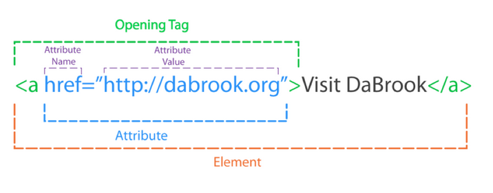
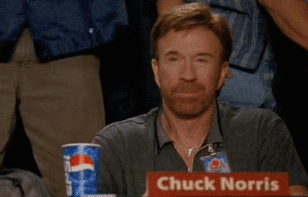
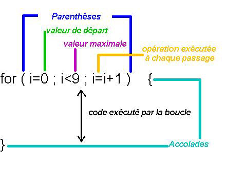
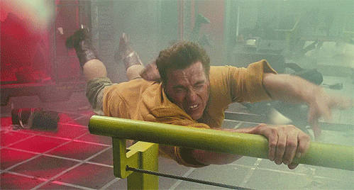

### Non !!


Note: cette diapo est au début pour pouvoir rapidement y accéder avec la touche "Home"


# EJ 08/10/2016

## Atelier programmation


### Lucas Cimon

- ingénieur & programmeur
- travaille à Voyages-Sncf.com
- passioné par Linux & le language Python
- http://chezsoi.org/lucas


### Ce qu'on va faire aujourd'hui


### Ce qu'on va faire aujourd'hui

Non. Ça devrait être plus rigolo que ça.


### Étape n°1 : les outils


### Intro


### Challenge n°1


### Challenge n°2


### Anatomie d'une balise HTML




### Boum


### Challenge n°3


### Challenge n°4




### Anatomie d'une boucle "for"




### Challenge n°5




### Définition d'une fonction Javascript

<style>
code {
    font-size: xx-large !important;
}
</style>

```
function monNomDeFonction(paramètre1, paramètre2) {
    // ... code ...
}
```


### Et ensuite ?

- CodeCombat (FR)
- OpenClassrooms (FR)
- CodingGame (EN)
- PhaserJS (EN) pour développer un jeu vidéo

Des questions ? Contactez-moi ! <a href="mailto:lucas.cimon@gmail.com">lucas.cimon@gmail.com</a>.

Et pour retrouver Ed pour d'autres aventures: http://www.imdb.com/title/tt0213338/
